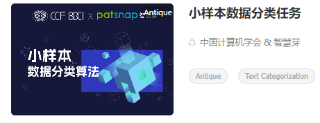
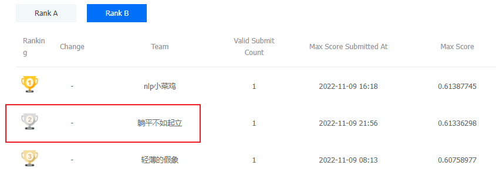

# 比赛

比赛地址：https://www.datafountain.cn/competitions/582





# 选手信息

以下为选手姓名，单位，邮箱：

* 杨思超
* 周扬
* 汤若聪


# B榜结果复现

一键运行`python code/inference/inference.py`即可复现，将读取user_data/b_models下的模型参数。

注意：环境配置可选择直接从`requirements.txt`里安装，也可选择运行`docker image`，如果是后者，请参考image文件夹下的readme。

# 模型训练

模型训练分两个差异版本，第一个版本放在`train`里，第二个版本放在`train2`里。下面分别进行说明：
公开数据，预训练模型

## train1版本说明

### train1-分类任务训练

运行 `code/train/train.py` 进行训练。

！！注意：需要在user_data中放入相应的开源的预训练参数。现在打包的包含：

1.mac_bert: https://github.com/ymcui/MacBERT
2.nezha: https://github.com/lonePatient/NeZha_Chinese_PyTorch 
由于版本原因，nezha的参数需要进行处理，即将开源参数中参数名中的nezha.部分去除，如`nezha.embeddings.word_embeddings --> embeddings.word_embeddings`

代码如下：

```
new_paras = OrderedDict()
for name, emb in paras.items():
    if 'nezha' in name:
        name = name.replace('nezha.', '')
    new_paras[name] = emb
```

在args中调整模型训练参数，如预训练模型类型可选bert及nezha，是否使用伪标签，是否使用reinit等。

可使用多组超参数，最终训练相关的输出如验证集的F1将被写在一个txt的文件中。

最终两个预训练参数存放在网盘：

【超级会员V5】通过百度网盘分享的文件：nezha_mo...等3个文件
链接：https://pan.baidu.com/s/1NgJKPqcPCl37MvKks2APyw 
提取码：yfhS 
复制这段内容打开「百度网盘APP 即可获取」

### train1-伪标签预测代码

预测代码在`code/inference/B_pred/all_pred.ipynb`, 将所有模型权重放在 `./model_weights`下运行即可。

初赛的代码跟当前代码整体有点不一样的原因，在于a榜时期节奏快，迭代快。现在提交的代码整体结构进行了简介和整理，为最终使用的方案。

其中预测B榜伪标签的代码存放在网盘的a_model_weights。
地址为：

【超级会员V5】通过百度网盘分享的文件：nezha_mo...等3个文件
链接：https://pan.baidu.com/s/1NgJKPqcPCl37MvKks2APyw 
提取码：yfhS 
复制这段内容打开「百度网盘APP 即可获取」

### train1-领域内预训练

利用比赛和[开源专利数据集](https://discussion.datafountain.cn/articles/detail/3601)可以对模型进行领域内无监督预训练，`code/train/pretrain_domain_code.py`使用的是transformers已经包好的api。

`code/train/pretrain_code/`里的代码可使用wwm或者n-grammask方式，可调节各种预训练细节，pretraining_args.py中设置对应参数即可。需要提前处理好预训练数据,示例为abstracts_new.txt

## train2版本说明

### train2-分类任务训练

直接运行`code\train2\code\main.py`可以进行半监督训练，以来训练集数据，增强数据和伪标签数据。增强的数据只来自于A榜数据，增强方式可以在`code\train2\code\edazh`里查看（百度API回译，[simbert](https://github.com/ZhuiyiTechnology/simbert)和[eda](https://github.com/jasonwei20/eda_nlp)）。

依赖的数据为预训练的nezha模型(`code\train2\data\model`)，A/B榜的伪标签(`code\train2\data\pseudo_labels_xxx.json`)，增强数据集(`code\train2\data\train_aug.json`)

地址为：

链接：https://pan.baidu.com/s/1QgeUEYZvlj0-JBogBdaFtw 
提取码：xvgx 
--来自百度网盘超级会员V7的分享

### train2-伪标签预测代码

B榜打伪标签的方式和A榜有所不同，因为只有3次机会，且没有预测结果反馈，所以我们把train1和train2的A榜最优模型的结果都拿了过来做集成。具体来说包含了train1的A榜最优模型三个5折模型，和train2的A榜最优模型一个5折最优f1模型和一个5折后10轮ema模型的预测结果。

其中最优train1的模型在上面分享链接里的`a_model_weights`文件夹下，最优train2的模型在下面分享链接里的`20221108_22-47_final`文件夹下。具体预测集成代码和结果在下面分享链接里的`pseudo_label_testB`文件夹下。

地址为：

链接：https://pan.baidu.com/s/1QgeUEYZvlj0-JBogBdaFtw 
提取码：xvgx 
--来自百度网盘超级会员V7的分享

### train2-领域内预训练

依赖的数据为比赛和[开源专利数据集](https://discussion.datafountain.cn/articles/detail/3601)，预训练代码在`code\train2\code\pretrain.py`里。